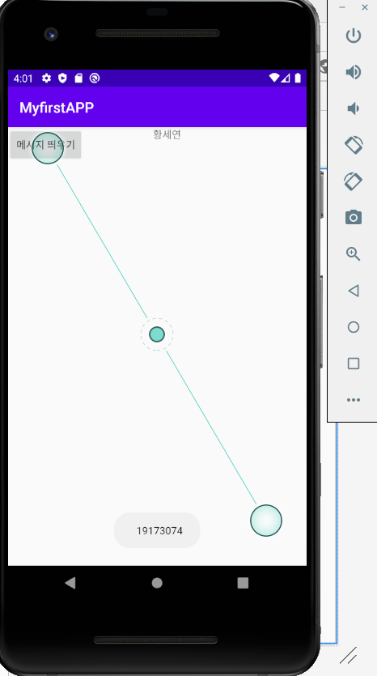
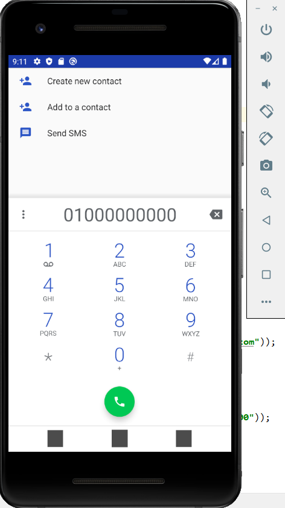

# MyFirstRepository

Hello my name is Seyeon!

## 1주차 과제
</img>

## 2주차 과제
</img>

## 3주차 과제
</img>
</img>

## 4주차 과제
-아이디어 : 화상공유로 함께 스터디를 할 수 있는 앱
           줌과 비슷하게 화면을 틀어놓고 학우들과 스터디를 할 수 있는 앱을 만들고 싶습니다. 하지만 줌과 차별점이라 하면, 화면에서 내가 공부를 몇 분 했는지 확인이 가능하고 줌과는 달리 결제를 하지 않아도 공부를 할 수 있는 무료 앱으로 개발하고 싶습니다.
           
           
## 7주차 과제
</img>
</img>
